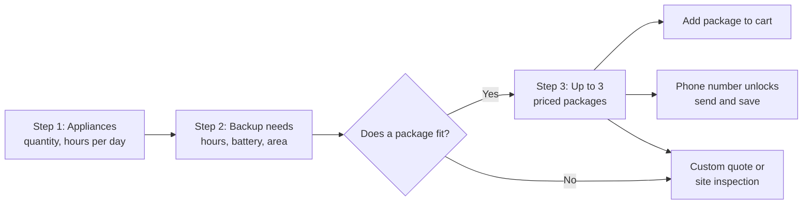
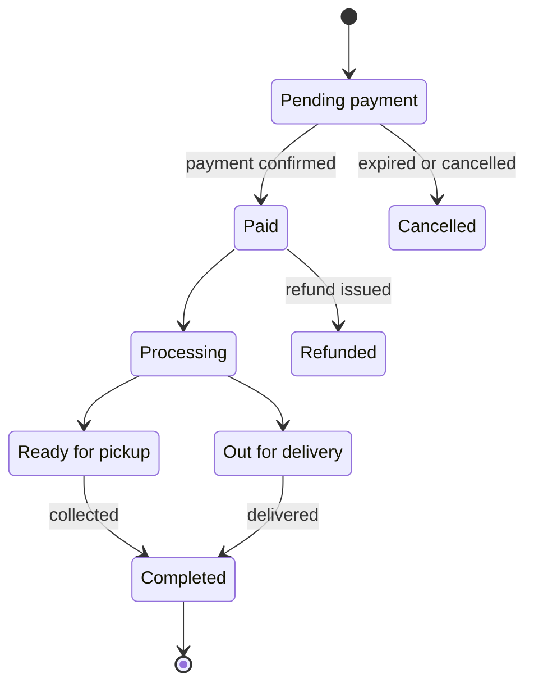

# J Solar World — E-commerce Website PRD

Sep 17, 2026 · @Rex Edge

Launch scope: Home, About, Products (a full store), Services and Get a Quote pages, plus an admin dashboard, a blog and SEO foundations.

## 1. Overview

The site has three jobs: sell solar equipment end to end, turn "what do I need?" into leads, and win local search traffic. J Solar World sells solar panels, inverters and batteries, and offers related services, from its shop in Alaba International Market, Ojo, Lagos.

The problem: most buyers can't size a solar system themselves. They don't know which inverter, how many batteries, or how many panels to buy. Answering that one conversation at a time limits sales and leaves out buyers who can't visit Alaba.

### Goals

| Goal | Measured by |
|---|---|
| Sell online end to end: browse, cart, pay, deliver or collect | Online orders and revenue per month |
| Turn unsure visitors into leads through the quote tool | Quotes completed, phone numbers captured, leads won |
| Rank for high-intent local searches from launch | Organic sessions and rankings for target keywords |
| Let staff run the store without a developer | Prices, stock and posts updated by staff in admin |

### Non-goals for launch

- Multi-vendor marketplace: only J Solar World sells.
- Native mobile apps: the website is mobile-first instead.
- Engineering-grade system design: the quote tool estimates, and a site inspection confirms.
- In-house credit or financing, and accounting or ERP integration.

## 2. Users

The quote tool serves buyers who don't know specs; filters and spec tables serve installers who already do.

| User | Who they are | What they need from the site |
|---|---|---|
| Homeowner or tenant | Household tired of outages and fuel costs; not technical | Plain-language sizing, a total price, installation |
| Small business owner | Shop, office, salon, pharmacy or clinic that can't afford downtime | Sizing for business equipment, installation, maintenance |
| Installer or reseller | Technician or trader who knows the specs and may buy in bulk | Fast search, full specs, current prices and stock |
| Diaspora buyer | Nigerian abroad buying a system for family at home | Trust signals, remote payment, delivery and installation arranged |
| J Solar World staff | Sales, store and content staff | Simple admin for products, orders, leads and posts |

## 3. Scope and phasing

Launch ships every page in the brief plus the blog; Phase 2 adds features that lift conversion and repeat sales.

| Area | Launch | Phase 2 |
|---|---|---|
| Pages | Home, About, Products, Services, Get a Quote, Blog, legal pages | Installations gallery page, location pages for SEO |
| Store | Catalogue, filters, search, packages, cart, guest checkout, gateway and transfer payments, delivery zones, order tracking | Reviews, discount codes, installer pricing, instalment payments, abandoned-cart reminders |
| Quote tool | Calculator, package matching, lead capture, WhatsApp and email sending, PDF quotes | Savings vs a petrol generator, finer sizing using grid-supply hours |
| Admin | Products, packages, stock, orders, leads, bookings, content, quote settings, delivery zones, staff roles | Sales reports, sync with the shop's POS or stock records |
| Messaging | Email and SMS notifications, WhatsApp click-to-chat | Automated WhatsApp template messages |
| SEO | Technical SEO, structured data, sitemap, editable metadata, 4–6 launch posts | Programmatic location pages, link building |

The brief lists the blog as optional. It sits in launch scope because rankings take months to build, and a few posts at launch start that clock on day one.

Priority labels in the requirement tables: **P0** is required for launch, **P1** is planned for launch but can slip, and **P2** comes after launch.

## 4. Site map and navigation

Product URLs stay flat (`/products/:slug`), so a link never breaks when a product moves category.

| Page | URL | Purpose |
|---|---|---|
| Home | `/` | Introduce the brand; route visitors to the quote tool or store |
| Products (store) | `/products` | Browse and search everything |
| Category | `/categories/:slug`, e.g. `/categories/inverters` | Browse one category, including solar packages |
| Product | `/products/:slug` | Details and purchase; packages use the same template |
| Cart and checkout | `/cart`, `/checkout` | Review, pay, place order |
| Order tracking | `/track-order` | Guest lookup by order number plus phone or email |
| Services | `/services`, `/services/:slug` | Overview plus one page per service |
| Get a Quote | `/solar-quote`, `/solar-quote/:reference` | Calculator and shareable saved quotes |
| About | `/about` | Story, trust signals, directions, contact form |
| Blog | `/blog`, `/blog/:slug`, `/blog/category/:slug` | Search-driven content |
| Account | `/account` | Orders, addresses, saved quotes |
| Legal | `/privacy`, `/terms`, `/returns-and-warranty`, `/delivery` | Policies |
| Admin | `/admin` or an admin subdomain | Back office, never indexed |

- **Header:** logo, Products (menu by category), Services, Get a Quote (highlighted button), About, Blog, search, account, and cart with item count. It stays sticky on mobile.
- **Every page:** a floating WhatsApp button whose message names the page the visitor is on.
- **Footer:** phone, WhatsApp, email, shop address and hours, category and service links, legal links, social links, newsletter signup.

## 5. Page requirements

Every page has a goal and numbered requirements; the quote tool's sizing rules are in section 7.

### 5.1 Home

Goal: explain the offer in five seconds, then send visitors to the quote tool or the store.

| ID | Requirement | Priority |
|---|---|---|
| HOME-01 | Hero with a headline, one supporting line, a "Get a free solar quote" primary button and a "Shop products" secondary button. Use a real installation or shop photo, not stock imagery. | P0 |
| HOME-02 | Trust strip: years in business, installations completed, brands stocked, warranty promise. Figures editable in admin. | P0 |
| HOME-03 | "How it works" in three steps: list your appliances, get a recommended system, buy online or book installation. | P0 |
| HOME-04 | Featured categories, e.g. panels, inverters, batteries, packages and accessories. | P0 |
| HOME-05 | Featured products and best-selling packages, chosen in admin. | P0 |
| HOME-06 | Services overview linking to each service page. | P0 |
| HOME-07 | Location block: shop number and line in Alaba, landmarks, opening hours, map, call and WhatsApp buttons. | P0 |
| HOME-08 | Quick quote starter: pick a home type (self-contain, 2-bedroom flat, 3-bedroom flat, duplex, shop or office) to see a typical package and price range, then continue in the full calculator. | P1 |
| HOME-09 | Recent installations: photo, area and system size. | P1 |
| HOME-10 | Customer testimonials managed in admin. | P1 |
| HOME-11 | FAQ block with FAQ structured data. | P1 |
| HOME-12 | Latest three blog posts. | P1 |

### 5.2 About

Goal: make a first-time visitor comfortable paying a large sum online.

| ID | Requirement | Priority |
|---|---|---|
| ABT-01 | Company story, mission and years in operation. | P0 |
| ABT-02 | Why choose us: genuine products, warranty support, installation expertise, after-sales service. Final claims come from the client. | P0 |
| ABT-03 | How to find us: line, block and shop number inside Alaba, nearby landmarks, shop-front photos, map embed. | P0 |
| ABT-04 | Contact options: phone, WhatsApp, email, and a short form (name, phone, message) that lands in admin. | P0 |
| ABT-05 | CAC registration number, brand partnerships and authorised-dealer badges. | P1 |
| ABT-06 | Team photos, names and roles, if the client is comfortable sharing them. | P1 |

The brief has no separate Contact page, so contact lives here, in the footer, and behind the WhatsApp button on every page.

### 5.3 Products (store)

Goal: let buyers find the right item fast and check out without calling.

| ID | Requirement | Priority |
|---|---|---|
| STR-01 | Product listing with category menu, sort (price, newest, best-selling) and pagination. | P0 |
| STR-02 | Filters: category, brand, price range, availability, plus category specs (panel watts; inverter rating; battery chemistry, voltage and kWh). | P0 |
| STR-03 | Search with suggestions across names, brands, SKUs and specs, so "5kva" or "200ah" finds matches. | P0 |
| STR-04 | Product cards: image, name, key spec, price, sale price, stock status, add to cart. | P0 |
| STR-05 | Product page gallery (swipe on mobile, zoom on desktop), with optional video. | P0 |
| STR-06 | Naira price, sale price, and stock status: in stock, low stock, out of stock, or available on request. | P0 |
| STR-07 | Quantity, Add to cart, Buy now, and "Ask on WhatsApp" pre-filled with the product name and link. | P0 |
| STR-08 | Spec table driven by the category's template, plus a downloadable datasheet. | P0 |
| STR-09 | Warranty terms, delivery estimate, and an installation add-on where offered. | P0 |
| STR-10 | Packages: bundles of component products showing contents, what they can power, estimated backup time, and the package price against buying the parts separately. | P0 |
| STR-11 | "Not sure this fits? Get a quote" link into the calculator. | P0 |
| STR-12 | Editable price note: prices can change with exchange rates and lock once payment is confirmed. | P1 |
| STR-13 | "Works well with" compatible items and related products. | P1 |
| STR-14 | Category pages with an editable intro and FAQ for SEO. | P1 |
| STR-15 | Reviews, ratings and back-in-stock alerts. | P2 |

### 5.4 Services

Goal: explain each service and capture a booking with enough detail to schedule it.

| ID | Requirement | Priority |
|---|---|---|
| SRV-01 | Services overview: each service with a short description, what's included, an optional "from" price, and a Book button. | P0 |
| SRV-02 | One page per service. Proposed list: residential installation, commercial installation, site inspection, maintenance, repairs, system upgrades, battery or inverter replacement. The client confirms the final list. | P0 |
| SRV-03 | Booking form: service, name, WhatsApp phone, optional email, state, area, address, preferred date and time window, notes, and optional photos of the site or current setup. | P0 |
| SRV-04 | Confirmation on screen, by email and by SMS; the booking appears in admin with a status. | P0 |
| SRV-05 | Coverage areas, plus any inspection or travel fee outside Lagos. | P1 |
| SRV-06 | Before-and-after photos or short case studies per service. | P1 |
| SRV-07 | Maintenance plans billed on a schedule. | P2 |

### 5.5 Get a Quote

Goal: turn an appliance list into a recommended, priced system and a sales lead.

Results show before the phone number is asked; the number unlocks sending, saving and sales follow-up.

| ID | Requirement | Priority |
|---|---|---|
| QTE-01 | Three-step flow with a progress bar; going back keeps inputs; comfortable to use one-handed on a phone. | P0 |
| QTE-02 | Step 1: appliance picker grouped by type (lighting, cooling, entertainment, kitchen, work, water and security) with default watts; set quantity and hours per day. | P0 |
| QTE-03 | Custom appliance: name and watts, with help on reading the rating label. | P0 |
| QTE-04 | Step 2: backup hours (presets for 4, 8 or 12 hours, or overnight), battery preference (lithium, tubular, or "recommend for me"), state and area, plus optional budget and daily grid-supply hours. | P0 |
| QTE-05 | Warning when high-draw items flagged in the library (e.g. pressing iron, electric cooker, kettle, water heater) are added, with an option to keep them off battery backup. | P0 |
| QTE-06 | Step 3: needs in plain words (load, daily energy, battery and panel needs), then up to three packages chosen per section 7. | P0 |
| QTE-07 | Each package shows components with product links, quantities, prices, installation estimate, total, and estimated backup hours. | P0 |
| QTE-08 | Actions per package: add the whole package to cart, book a site inspection, or send the quote. | P0 |
| QTE-09 | When no package fits, show the computed needs and route to a custom quote or site inspection. | P0 |
| QTE-10 | Lead capture: WhatsApp phone number required to send or save; name and email optional; consent checkbox for follow-up. | P0 |
| QTE-11 | Saved quotes get a reference number, store inputs, outputs and prices at that moment, and show a validity period (default 7 days). | P0 |
| QTE-12 | Send by WhatsApp (click-to-chat with a summary and link) and by email. | P0 |
| QTE-13 | Disclaimer: the result is an estimate; the final design is confirmed after a site inspection. | P0 |
| QTE-14 | Running totals (watts and kWh per day) update while appliances are picked. | P1 |
| QTE-15 | Home-type presets pre-fill typical appliance lists. | P1 |
| QTE-16 | Branded PDF quote, and a shareable link for a spouse, landlord or relative abroad. | P1 |
| QTE-17 | Savings estimate against running a petrol generator, with the fuel price set in admin. | P2 |

### 5.6 Blog

Goal: capture buyers researching prices and sizing, then send them to products and the quote tool.

| ID | Requirement | Priority |
|---|---|---|
| BLG-01 | Blog index with categories (buying guides, prices, installation, maintenance, news), tags, search and pagination. | P1 |
| BLG-02 | Post page: title, author, published and updated dates, featured image, contents list for long posts, share buttons, related posts. | P1 |
| BLG-03 | Product cards and a quote-tool button can be placed inside posts. | P1 |
| BLG-04 | Admin editor with drafts, scheduling, preview, SEO fields and required image alt text. | P1 |
| BLG-05 | Article structured data; new posts join the sitemap automatically. | P1 |

Launch post ideas, each matched to a buying question:

- How many solar panels does a 3-bedroom flat in Lagos need?
- Lithium vs tubular batteries: which should you buy?
- What can a 5kVA inverter carry?
- Solar inverter prices in Nigeria, updated monthly
- Can solar power an air conditioner?
- Looking after your solar system in the rainy season

### 5.7 Global elements and legal pages

Goal: keep contact one tap away on every page and publish the policies buyers expect.

| ID | Requirement | Priority |
|---|---|---|
| GLB-01 | Header and footer as described in section 4. | P0 |
| GLB-02 | Floating WhatsApp button on every page, pre-filled with the page name. | P0 |
| GLB-03 | Legal pages: privacy policy, terms of sale, returns and warranty, delivery policy, cookie notice. | P0 |
| GLB-04 | Custom 404 page with search and popular categories. | P0 |
| GLB-05 | Newsletter signup with consent, stored in admin and exportable. | P1 |

## 6. E-commerce flow

Checkout offers guest purchase, gateway payment, bank transfer, and reserve-and-pay-in-shop, so buyers aren't forced into one way of paying.

### 6.1 Cart

| ID | Requirement | Priority |
|---|---|---|
| CRT-01 | Cart persists across visits for guests and signed-in users. | P0 |
| CRT-02 | Change quantities, remove items, and see line totals, subtotal, and a delivery estimate once a location is set. | P0 |
| CRT-03 | Stock is checked when an item is added and again at checkout. | P0 |
| CRT-04 | Installation add-on for eligible items and packages, priced by admin rules. | P1 |
| CRT-05 | Abandoned-cart reminders for shoppers who left contact details and consented. | P2 |

### 6.2 Checkout and payment

| ID | Requirement | Priority |
|---|---|---|
| CHK-01 | Guest checkout, with optional account creation after purchase. | P0 |
| CHK-02 | Contact details: full name, phone, and email (the payment gateway requires one). | P0 |
| CHK-03 | Delivery details: state, LGA or area, street address, nearest landmark, notes. | P0 |
| CHK-04 | Fulfilment choice: pickup at the Alaba shop, Lagos delivery priced by zone, or interstate delivery priced by state, each with a timeline. | P0 |
| CHK-05 | Online payment by card, bank transfer or USSD through Paystack or Flutterwave. | P0 |
| CHK-06 | Manual transfer to the company account with proof upload; staff confirm funds before release. | P0 |
| CHK-07 | Tax line follows admin VAT settings: on or off, rate, and inclusive or exclusive prices. | P0 |
| CHK-08 | Review step with terms acceptance before the order is placed. | P0 |
| CHK-09 | Payment is confirmed by verified gateway webhooks, not the browser redirect, and order updates are idempotent. | P0 |
| CHK-10 | Confirmation page, email and SMS with order number, items, totals, fulfilment and next steps. | P0 |
| CHK-11 | Price locks once payment is confirmed; unpaid orders expire after a set window (e.g. 24 hours) and release held stock. | P0 |
| CHK-12 | Reserve and pay in shop: hold items for a set period (e.g. 48 hours) for buyers who want to inspect first. | P1 |
| CHK-13 | Discount codes, and instalment payments through a partner. | P2 |

### 6.3 Orders and fulfilment

Orders move from pending payment to completed, with cancel and refund exits.

Every change is timestamped and logged; installation runs as a linked service booking, not an order status.

| ID | Requirement | Priority |
|---|---|---|
| ORD-01 | Status changes are timestamped, logged against the staff member, and optionally sent to the customer. | P0 |
| ORD-02 | Guest order tracking by order number plus phone or email. | P0 |
| ORD-03 | PDF invoice and receipt with company details, items and tax line. | P0 |
| ORD-04 | Full and partial refunds recorded; gateway refund triggered where supported. | P1 |
| ORD-05 | Orders that include installation create a linked service booking. | P1 |

### 6.4 Customer accounts

| ID | Requirement | Priority |
|---|---|---|
| ACC-01 | Sign up and sign in with email and password; phone OTP optional. | P1 |
| ACC-02 | Order history, saved addresses, saved quotes, profile. | P1 |
| ACC-03 | Past guest orders and quotes link to an account once its email or phone is verified. | P1 |

### 6.5 Notifications

At launch, WhatsApp is click-to-chat only; automated WhatsApp messages wait for Phase 2 because they need Meta approval and carry usage fees.

| Event | Customer receives | Staff receive |
|---|---|---|
| Order placed, awaiting payment | Email and SMS with payment instructions | Dashboard alert |
| Payment confirmed | Email and SMS receipt | Alert to sales and store |
| Transfer proof uploaded | Nothing | Alert to verify funds |
| Order status changed | Email and SMS, per status settings | Nothing |
| Quote saved | WhatsApp link and email | New-lead alert to sales |
| Service booked | Email and SMS confirmation | Alert to sales and technicians |
| Stock below threshold | Nothing | Alert to store manager |

## 7. Quote engine

The engine works out what the home needs, then picks the cheapest engineer-approved package that meets every need.

Matching parts one by one can pair an inverter with a battery voltage or panel string it can't handle. J Solar World's engineers approve each package once in admin, and the engine only chooses among those.

### 7.1 Inputs and defaults

Defaults are starting assumptions for J Solar World's engineers to confirm; all are editable in admin.

| Input | Set by | Default |
|---|---|---|
| Watts, quantity and hours per day for each appliance | Customer, pre-filled from the library | See 7.5 |
| Duty cycle: share of time a cycling load actually runs | Appliance library | 1.0; fridges and freezers 0.4 |
| Surge multiplier: start-up draw of motors | Appliance library | 1×; motor loads 2–4× |
| Backup hours | Customer | 12 (overnight) |
| Battery chemistry | Customer | Lithium |
| Peak sun hours | Admin | 4.0 for Lagos, deliberately cautious |
| System derate: wiring, heat, dust and charging losses | Admin | 0.75 |
| Inverter efficiency | Admin | 0.90 |
| Inverter safety margin | Admin | 1.25 |
| Depth of discharge | Admin | Lithium 0.8, tubular 0.5 |
| Diversity factor: share of backup loads running at once | Admin | 0.7 |
| Budget option battery floor | Admin | 60% of battery need |
| Quote validity | Admin | 7 days |

### 7.2 Formulas

| Quantity | Formula |
|---|---|
| Peak load P (W) | Sum of watts × quantity across all appliances |
| Surge load S (W) | P + the largest single start-up extra among motor loads: watts × (surge − 1) |
| Daily energy E (Wh) | Sum of watts × quantity × hours × duty cycle |
| Inverter need | Continuous rating ≥ P × safety margin, and surge rating ≥ S |
| Average backup load L (W) | Sum of watts × quantity × duty cycle for backup items, × diversity factor |
| Battery need C (Wh) | L × backup hours ÷ (depth of discharge × inverter efficiency) |
| Solar array need A (W) | E ÷ (peak sun hours × derate) |
| Backup a package gives (hours) | Battery Wh × depth of discharge × inverter efficiency ÷ L |

Check the inverter need against each model's rated continuous watts, stored in its specs, not the kVA in its name. kVA-to-watt ratios vary by brand.

### 7.3 Package matching

| Option shown | Rule |
|---|---|
| Recommended | Cheapest approved package meeting the inverter, battery and array needs in the chosen chemistry |
| Budget | Cheapest package meeting the inverter need with at least 60% of C; its shorter backup time is stated plainly |
| More headroom | Next approved package above Recommended that also meets every need |
| Custom | No package fits: show the needs and route to a site inspection |

Leads are flagged for engineer review when high-draw items stay on backup or the custom route triggers.

### 7.4 Worked example: a 2-bedroom flat

With 10 hours of backup, this flat needs a 669 W continuous inverter, about 4.3 kWh of lithium storage, and three 550 W panels.

| Appliance | Qty | Watts each | Load (W) | Hours/day | Duty | Wh/day |
|---|---|---|---|---|---|---|
| LED bulb | 6 | 10 | 60 | 6 | 1.0 | 360 |
| Ceiling fan | 2 | 75 | 150 | 8 | 1.0 | 1,200 |
| TV, 43-inch | 1 | 80 | 80 | 5 | 1.0 | 400 |
| Decoder | 1 | 20 | 20 | 5 | 1.0 | 100 |
| Wi-Fi router | 1 | 10 | 10 | 24 | 1.0 | 240 |
| Laptop | 1 | 65 | 65 | 6 | 1.0 | 390 |
| Fridge (surge 3×) | 1 | 150 | 150 | 24 | 0.4 | 1,440 |
| **Total** | | | **535** | | | **4,130** |

| Result | Working | Value |
|---|---|---|
| Peak load P | Sum of the load column | 535 W |
| Surge load S | 535 + 150 × (3 − 1) | 835 W |
| Inverter need | 535 × 1.25, and surge ≥ S | ≥ 669 W continuous, ≥ 835 W surge |
| Daily energy E | Sum of the Wh/day column | 4.13 kWh |
| Average backup load L | (60 + 150 + 80 + 20 + 10 + 65 + 150 × 0.4) × 0.7 | ≈ 312 W |
| Battery need C | 312 × 10 ÷ (0.8 × 0.9) | ≈ 4.33 kWh |
| Solar array need A | 4,130 ÷ (4.0 × 0.75) | ≈ 1,377 W, so three 550 W panels |

The engine then picks the cheapest approved package that clears all of those numbers. A 5 kWh lithium package would give about 11.5 hours at this load. With tubular batteries (depth of discharge 0.5), the battery need rises to about 6.9 kWh, a trade-off the results page should explain.

### 7.5 Appliance library starter values

These are typical, approximate ratings to seed the library; J Solar World's engineers should confirm them before launch.

| Appliance | Watts | Duty | Surge | High-draw warning |
|---|---|---|---|---|
| LED bulb | 10 | 1.0 | 1× | No |
| Phone charger | 10 | 1.0 | 1× | No |
| Wi-Fi router | 10 | 1.0 | 1× | No |
| Decoder | 20 | 1.0 | 1× | No |
| CCTV kit (4 cameras and recorder) | 40 | 1.0 | 1× | No |
| TV, 32-inch LED | 50 | 1.0 | 1× | No |
| LED security light | 50 | 1.0 | 1× | No |
| Standing fan | 55 | 1.0 | 1× | No |
| Laptop | 65 | 1.0 | 1× | No |
| Ceiling fan | 75 | 1.0 | 1× | No |
| TV, 43-inch LED | 80 | 1.0 | 1× | No |
| Sound system | 100 | 1.0 | 1× | No |
| TV, 55-inch LED | 110 | 1.0 | 1× | No |
| Refrigerator | 150 | 0.4 | 3× | No |
| Desktop computer and monitor | 200 | 1.0 | 1× | No |
| Chest freezer | 200 | 0.4 | 3× | No |
| Blender | 400 | 1.0 | 2× | No |
| Water pump, 0.5 HP | 450 | 1.0 | 4× | No |
| Washing machine | 500 | 0.5 | 2× | No |
| Air conditioner, 1 HP, non-inverter | 900 | 0.7 | 3× | No |
| Microwave | 1,000 | 1.0 | 1× | Yes |
| Pressing iron | 1,000 | 0.5 | 1× | Yes |
| Air conditioner, 1.5 HP, non-inverter | 1,300 | 0.7 | 3× | No |
| Electric kettle | 1,500 | 1.0 | 1× | Yes |
| Electric cooker or hot plate | 1,500 | 0.6 | 1× | Yes |
| Water heater | 2,000 | 0.5 | 1× | Yes |

## 8. Admin dashboard

Four staff roles share one admin, and every price, stock and order change is logged against the person who made it.

| Role | Can do |
|---|---|
| Owner (super admin) | Everything, including payment settings, staff and roles |
| Store manager | Products, packages, stock, orders, delivery zones |
| Sales rep | Leads, quotes, bookings and customers; view and update orders |
| Content editor | Blog, page content, testimonials, gallery, SEO fields |

| ID | Module | Requirements | Priority |
|---|---|---|---|
| ADM-01 | Dashboard | Sales today, this week and this month; orders by status; new leads and bookings; low stock; transfers awaiting confirmation | P0 |
| ADM-02 | Products | Create, edit, duplicate, archive; images with required alt text; category spec templates; brand, SKU, price, sale price, stock and low-stock threshold; weight and size; warranty; datasheet; SEO fields; draft or published | P0 |
| ADM-03 | Bulk tools | CSV import and export; bulk price change by percent or amount, filtered by category or brand, for exchange-rate swings | P0 |
| ADM-04 | Categories and brands | Create, reorder, and edit intros and spec templates | P0 |
| ADM-05 | Packages | Build from component products and quantities; fixed or discounted price; the capacity fields the engine reads (inverter continuous and surge watts, battery Wh and chemistry, array watts); "what it can power" text; engineer-approved flag | P0 |
| ADM-06 | Orders | Filter and search; detail view; status changes; confirm transfers against uploaded proof; internal notes; print invoice; refunds | P0 |
| ADM-07 | Leads and quotes | Pipeline (new, contacted, inspection booked, won, lost); assign to a rep; notes and reminders; snapshot of inputs and outputs; sale value when won; export | P0 |
| ADM-08 | Service bookings | List and calendar views; assign a technician; status; notes | P0 |
| ADM-09 | Quote engine settings | Appliance library, home-type presets, sizing defaults, high-draw rules, quote validity, installation fee rules | P0 |
| ADM-10 | Delivery | Lagos zones and state fees, timelines, pickup details | P0 |
| ADM-11 | Content | Page blocks (hero, trust figures, about, services), testimonials, FAQs, gallery, and blog posts per BLG-04 | P0 |
| ADM-12 | Settings | Business details, transfer bank account, WhatsApp number, notification templates, gateway keys, VAT settings, policy pages | P0 |
| ADM-13 | Staff and security | Invite staff, assign roles, two-factor sign-in, audit log | P0 |
| ADM-14 | Customers | List, profile, orders, quotes, bookings, export | P1 |
| ADM-15 | SEO tools | Per-page metadata overrides, redirect manager | P1 |
| ADM-16 | Reports | Sales by product, category and channel; lead conversion | P2 |

## 9. SEO requirements

Every public page renders as server-side HTML with its own metadata and structured data, and meets Core Web Vitals on mobile.

| ID | Requirement | Priority |
|---|---|---|
| SEO-01 | Server-rendered or static HTML for all public pages, so content is visible without JavaScript. | P0 |
| SEO-02 | Unique, editable title and meta description per page, with automatic defaults for products, categories and posts. | P0 |
| SEO-03 | Stable URLs per section 4; a 301 redirect is created whenever a slug changes. | P0 |
| SEO-04 | Canonical tags; filter and sort URLs canonicalised or set to noindex. | P0 |
| SEO-05 | Automatic XML sitemap and robots.txt; admin, cart, checkout and account pages excluded. | P0 |
| SEO-06 | JSON-LD structured data: LocalBusiness (address, map coordinates, hours, phone), Product with naira price and availability, BreadcrumbList, FAQPage and BlogPosting. | P0 |
| SEO-07 | Open Graph tags, so links shared on WhatsApp, Facebook, X and LinkedIn show an image, title and price. | P0 |
| SEO-08 | Core Web Vitals at the 75th percentile on mobile: LCP ≤ 2.5 s, INP ≤ 200 ms, CLS ≤ 0.1. | P0 |
| SEO-09 | Images served as WebP or AVIF in responsive sizes, lazy-loaded below the fold, with required alt text. | P0 |
| SEO-10 | One H1 per page, semantic HTML, breadcrumbs, and internal links between posts, products and the quote tool. | P0 |
| SEO-11 | Google Search Console and Bing Webmaster Tools verified; GA4 set up with e-commerce events. | P0 |
| SEO-12 | Location landing pages (e.g. solar installation in Lekki) built from a template with unique content. | P2 |

Local SEO starts outside the site. Claim and verify the Google Business Profile, keep the name, address and phone identical everywhere, and ask for reviews after each delivery.

Starting keyword themes are inverter prices in Lagos, 5kVA inverter prices, lithium battery prices, solar panel prices at Alaba, and solar installers in Lagos. Confirm search volumes with keyword research before planning content.

## 10. Non-functional requirements

The site is built first for mid-range Android phones on patchy mobile data, with security suited to taking payments.

| Area | Requirement |
|---|---|
| Mobile and network | Mid-range Android phones first; key pages under 1 MB on first load; checkout survives dropped connections without double charging |
| Performance | Core Web Vitals per SEO-08; CDN for images and static files |
| Security | HTTPS everywhere; OWASP Top 10 protections; rate limits on sign-in, forms and the quote tool; two-factor sign-in for admin; no card data stored; signed webhooks; upload type and size limits |
| Privacy | Nigeria Data Protection Act 2023: privacy policy, opt-in marketing consent, cookie notice, data minimisation, retention rules, and a way to request access or deletion |
| Accessibility | WCAG 2.2 AA: keyboard use, colour contrast, labelled fields, alt text |
| Reliability | 99.5% monthly uptime target; daily backups with tested restores; error monitoring and alerts |
| Browsers | Chrome on Android first; latest two versions of Chrome, Safari, Edge and Firefox |
| Locale | Naira with thousands separators; +234 phone validation; DD/MM/YYYY dates; West Africa Time |
| Maintainability | Staff update prices, stock, products and posts without a developer |

## 11. Analytics and success metrics

Track the quote funnel as closely as the store; many sales may close on WhatsApp or in the shop, traced by quote reference.

| Funnel | Events |
|---|---|
| Quote tool | `quote_started`, `quote_step_completed`, `quote_completed`, `lead_submitted`, `quote_sent` |
| Store | `view_item`, `add_to_cart`, `begin_checkout`, `add_payment_info`, `purchase` |
| Contact | `whatsapp_click`, `call_click`, `booking_submitted`, `newsletter_signup` |

| Metric | What it shows |
|---|---|
| Quote completion rate | Whether the calculator is easy to finish |
| Quote-to-lead rate | Whether results persuade people to share a number |
| Lead-to-sale rate and value | Whether leads become revenue, from the admin pipeline |
| Store conversion and checkout abandonment | Where online buyers drop off |
| Average order value | Mix of packages versus single items |
| Organic sessions and keyword rankings | Whether SEO and the blog are working |
| WhatsApp and call clicks | Demand that bypasses checkout |

Targets are set after a 30-day baseline and agreed with J Solar World.

## 12. Recommended technical approach

Use Next.js for the storefront, PostgreSQL for data, and Paystack or Flutterwave for payments; the backend is the main open choice.

| Layer | Recommendation |
|---|---|
| Storefront | Next.js with TypeScript and Tailwind CSS, using server rendering and static generation for SEO |
| Commerce backend | Option A: an open-source headless engine such as Medusa, extended with quote and lead modules; faster to cart and orders. Option B: a custom Node.js API such as NestJS; full control, longer build |
| Database | PostgreSQL |
| Payments | Paystack or Flutterwave, whichever the client can activate, plus the manual transfer flow |
| Media | Cloudinary or S3-compatible storage behind a CDN |
| Email | A transactional provider such as Resend, Postmark or Amazon SES |
| SMS | A Nigerian SMS provider such as Termii |
| Blog editing | Built into the admin, or a headless CMS such as Payload if editors want richer editing |
| Search | PostgreSQL full-text search at launch; Meilisearch if the catalogue grows large |
| Hosting | Vercel or similar for the storefront; managed Postgres and a container host for the API; Cloudflare for DNS |

## 13. Risks and mitigations

Stale prices and undersized systems are the biggest risks; both have admin-side controls in this spec.

| Risk | Impact | Mitigation |
|---|---|---|
| Prices go stale as the naira moves | Losses or angry customers | Bulk price updates, price lock at payment, 7-day quote validity, price note on product pages |
| Quote tool undersizes a system | Complaints and warranty disputes | Cautious defaults, engineer-approved packages only, disclaimer, inspection before large installs |
| Website stock differs from the shop floor | Selling items that aren't there | Daily stock routine, low-stock thresholds, "available on request" status, POS sync in Phase 2 |
| Fake transfer receipts | Goods released unpaid | Confirm funds in the bank app before marking paid; audit log; steer buyers to gateway payment |
| Low trust in paying online for big items | Weak conversion | Real photos, exact directions, CAC number, testimonials, reserve-and-pay-in-shop, WhatsApp support |
| Product data not ready | Launch delay | Collect specs, photos and prices from week one; launch with best sellers first |
| Blog stalls after launch | SEO gains fade | Content calendar (e.g. two posts a month) from a keyword-based topic list |

## 14. Open questions

Fifteen questions for J Solar World and two build decisions stand between this draft and design.

### For J Solar World

- [ ] Catalogue: which categories and brands do you stock, roughly how many SKUs, and do you have photos and datasheets?
- [ ] Pricing: should every price be public, or should some items say "request a price"?
- [ ] Wholesale: do installers and resellers get different prices or bulk terms?
- [ ] Customer mix: what share of sales comes from homeowners, businesses and installers?
- [ ] Payments: which gateway can you activate, and which account receives transfers?
- [ ] VAT: are you VAT-registered, and should prices show VAT included?
- [ ] Delivery: which areas do you cover, at what fees, and who handles interstate delivery?
- [ ] Installation: your own technicians or partners, which areas, and how is it priced?
- [ ] Warranty and returns: what terms apply to each product type?
- [ ] Packages: which bundles do you sell today, and will your engineers approve the sizing defaults and package specs?
- [ ] Stock: how is stock tracked now, and who will update the website each day?
- [ ] Instalments: do customers ask to pay in parts, and do you want a financing partner?
- [ ] Trust assets: logo files, colours, shop and installation photos, testimonials, CAC number, and exact shop location.
- [ ] Domain and email: existing or new?
- [ ] Content: who writes or approves blog posts?

### For the build team

- [ ] Backend: headless engine (Option A) or custom API (Option B)?
- [ ] Quote tool: keep results visible before the phone number is asked, or gate them behind it?

## 15. Milestones and glossary

The build runs in six milestones; dates depend on team size and how quickly product data arrives.

| Milestone | Done when |
|---|---|
| M1 Discovery and content | Open questions answered; product data, photos and brand assets collected |
| M2 Design | Mobile-first wireframes and UI approved for every page and the quote flow |
| M3 Store and admin core | Catalogue, cart, checkout, payments, orders and roles work end to end in staging |
| M4 Quote engine | Engine and packages approved by J Solar World's engineers against real customer cases |
| M5 SEO and content | Metadata, structured data, sitemap, launch posts and legal pages in place |
| M6 Testing and launch | Client testing passed; live payments verified; analytics and Search Console running |

| Term | Meaning |
|---|---|
| kVA and W | Inverter size. kVA is apparent power; watts are what appliances actually draw |
| kWh | Energy: 1,000 watts for one hour. Battery capacity and daily use are measured in it |
| kWp | Peak output of a solar array under standard test conditions |
| Depth of discharge | Share of a battery's capacity usable without shortening its life |
| Peak sun hours | Daily solar energy expressed as hours of full-strength sunlight |
| Surge | Short burst of extra power a motor draws when it starts |
| Duty cycle | Share of time a cycling appliance, such as a fridge compressor, actually runs |
| Hybrid inverter | One unit combining an inverter, a solar charge controller and grid charging |
